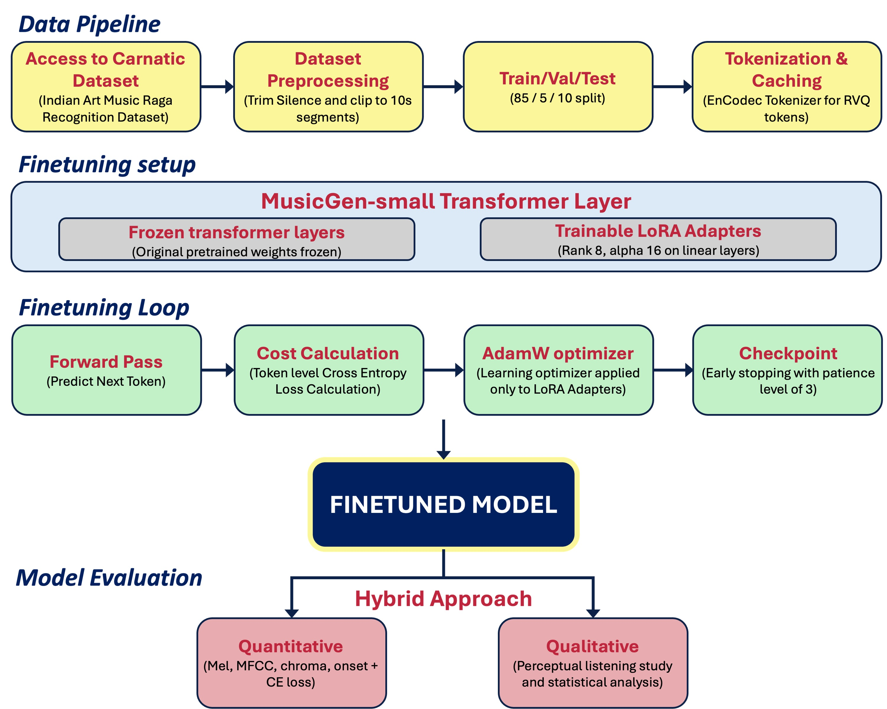

# FINE TUNING FOUNDATIONAL MUSIC MODEL #[MusicGen](https://dl.acm.org/doi/10.5555/3666122.3668188) FOR CARNATIC MUSIC CONTIUATION

## Course Work "INFO 697 Capstone Research"

**Project Motivation & Description**<br>
Foundation music models like MusicGen are trained predominantly on Western music, leaving culturally rich traditions such as Carnatic music underrepresented. This project fine-tunes MusicGen on ~10 hours of licensed Carnatic Music from the Indian Art Music Raga Recognition Dataset, using an audio-to-audio continuation framework, bypassing the need for scarce prompt-labeled Carnatic corpora. The goal is to generate stylistically coherent Carnatic continuations from short audio excerpts while preserving melodic and ornamental authenticity. Evaluation follows a hybrid approach, combining objective boundary distances (mel-spectrogram, chroma, MFCC, etc.) with human listening studies via a [Streamlit interface](https://capstone-user-evaluation-survey.streamlit.app).


## Dataset:
The audio dataset is currently not included in this repository due to its heavy file size.<br> 
Link to dataset:  <br>
[Indian Art Music Raga Recognition datasets](https://compmusic.upf.edu/datasets) [1]<br>

Link to the sample dataset: <br>
[Sample dataset](https://drive.google.com/drive/folders/1hdnKrlbUHkPReDeCAvJrAnbq7juKEMda?usp=share_link)<br>

The Sample dataset consists of 5 Carnatic music recordings converted to .wav format from the actual dataset.


## Methodology:<br>
An overview of the methodology followed for this project is as follows.<br>

<br>

For this project, I used Python in the Cursor IDE for coding. GPU-accelerated machine learning training and inference on macOS made available through Metal Performance Shaders (mps) of Apple silicon M4 chip was leveraged for finetuning. Listening studies were conducted through a Streamlit interface, and responses were recorded in Google Spreadsheets using the Google Drive API services.<br>


## Details on files & folders<br>
**This code repository is organised into the following key components:**<br>
- README.md: The current file you are reading gives an overview of the project.<br>
- initial_environment_setup.md: This file contains detailed 

- Reports: This section will be updated post completion of this project

| File | Description |
|------|-------------|
| `initial_environment_setup.md` | Step-by-step guide to fork/patch AudioCraft for Apple Silicon (disabling xFormers) and set up the Python 3.9 virtual environment with all MusicGen dependencies. |
| `dataset_relocation_and_conversion.ipynb` | Converts the raw RagaDataset audio files into 32 kHz `.wav` format under `dataset_wav/` and reports total duration statistics. |
| `classes.py` | Defines the custom `CachedRVQDataset` (loads cached EnCodec RVQ tokens from CSV) and `LoRALinear` (low-rank adapter that wraps and freezes a base `nn.Linear` layer). |
| `helpers.py` | Central utility module containing all helper functions — device/model loading, audio cleaning & segmentation, train/val/test splitting, EnCodec token caching, LoRA injection/training/checkpointing, and boundary-continuation evaluation metrics (Mel, MFCC, Chroma, Onset). |
| `pipelines.py` | High-level orchestration layer that chains helper functions into runnable end-to-end stages (reproducibility check, EnCodec confirmation, dataset prep, tokenization, baseline eval, LoRA fine-tuning, post-finetuning eval, quantitative eval). |
| `fine-tuning.ipynb` | Main execution notebook that runs the full MusicGen-Small LoRA fine-tuning pipeline for Carnatic music continuation by sequentially invoking the stage functions from `pipelines.py` (Steps 0–9). |

## How to use this repository? <br>

In the following section, I have given the details as per the way I have organized and experimented with my codes. <br>
Feature extraction was performed in Visual Studio code while EDA & Model Building was performed in Collab.
Follow the steps below, to experiment with my code:<br>
- Fork the repository <br>
- Run the following commands in your terminal.<br>
- Clone your forked repo to your local <br>
```bash
git clone https://github.com/sundarram1608/carnatic_music_raga_identification_mir.git
```
- Download the [Sample dataset](https://drive.google.com/drive/folders/14oVxOAg2Mu-I-rml4iA3Bmp-ABV8P8Nu?usp=sharing) provided (dataset folder), to the same folder as the other code files of this repo.
- Folder hierarchy as mentioned above is important for codes to execute seamlessly.
- Open terminal and follow the below CLI prompts one by one to create a virtual environment<br>
```bash
cd “path to directory“
```
```bash
python3 -m venv myenv
```
```bash
source myenv/bin/activate
``` 
```bash
pip install -r requirements.txt
```
- This creates the virtual environment necessary to run the sruthi identification/ standardization & raga feature extraction pipeline in Visual Studio code.
- If there are compute issues, you could upload the cloned repository to your Google Drive and open the ipynb file with Collab.
- In collab, select the GPU compute resource (for e.g. L4) and then mount your drive. From then, you are free to run and experiment with the code.
- All the .py and .ipynb files have guided comments and are self explanatory.

## Credits:
I thank my mentor Dr. Xiao Hu and all the references and citations I have mentioned below, to enable me with the structured thought process to approach this problem.
The codes in this repository, sample datasets and structuring solely belongs to the author and mentor.

## References:<br>
[1] Serrà, J., Ganguli, K. K., Sentürk, S., Serra, X., & Gulati, S. (2016). Indian Art Music Raga Recognition Dataset (audio) (1.0) [Data set]. Zenodo. https://doi.org/10.5281/zenodo.7278511<br><br>
[2] Sridhar, Rajeswari & Geetha, T.V. (2009). Raga Identification of Carnatic music for music Information Retrieval. SHORT PAPER International Journal of Recent Trends in Engineering. 1. [Research Gate](https://www.researchgate.net/publication/228960849_Raga_Identification_of_Carnatic_music_for_music_Information_Retrieval)<br><br>
[3] Shah, Devansh & Jagtap, Nikhil & Talekar, Prathmesh & Gawande, Kiran. (2021). Raga Recognition in Indian Classical Music Using Deep Learning. 10.1007/978-3-030-72914-1_17. [Research Gate](https://www.researchgate.net/publication/350553712_Raga_Recognition_in_Indian_Classical_Music_Using_Deep_Learning)<br><br>
[4] Ravikoti, Sridhar. (2020, September). Identifying Ragas in Carnatic Music with Machine Learning. [LinkedIn](https://www.linkedin.com/pulse/identifying-ragas-carnatic-music-machine-learning-sridhar-ravikoti/)<br><br>
[5] Great Learning Snippets. (2020, July). Deep Learning Based Raga Classification in Carnatic Music. [Medium](https://medium.com/@blogsupport/deep-learning-based-raga-classification-in-carnatic-music-e499018ea1b7)<br><br>
[6] Srinivasan, Shriya. (2021, August). Carnatic Raga Recognition. [Medium](https://medium.com/@shriya_32059/carnatic-raga-recognition-28ba52ec9563)<br><br>
[7] Divan, Shreyas. (2021, November). Raga identification using ML and DL. [Medium](https://medium.com/@shreyas.divan/raga-identification-using-ml-and-dl-a95b51f47044)

